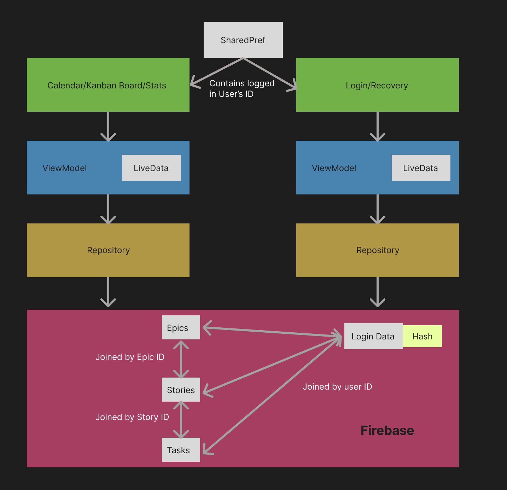
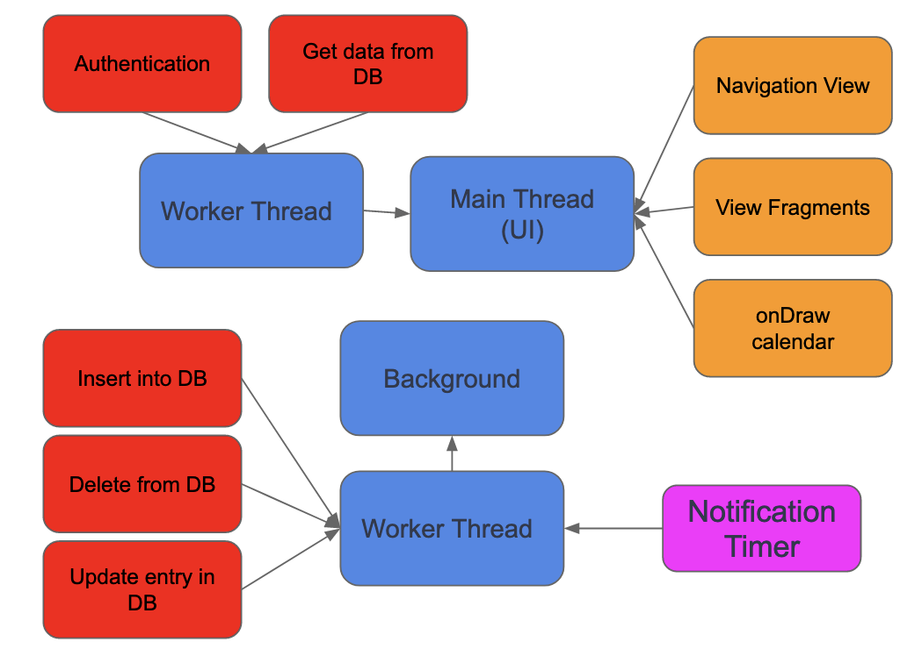

# Kalendar App

## Team Members
* Bryan Wong
    * Calendar 
         * Custom calendar view
         * Display stories 
         * Filter epics 
    * Misc. functionality
         * Fab 
         * Adding Epics
         * Viewing and editing Stories
* Karanvir Bath
    * Backend (Firebase)
         * Epic database
         * Story database 
         * Task database 
         * User database
    * Alarm
         * Schedule and cancelling alarms based on the times in a story
    * Notification
         * Alarms trigger notification to be created
         * Notifications contain story information and timer
* Divyam Sharma
    * Kanban Fragments
         * Display stories
         * Adding new stories
* Jeremy Choy
    * Login
         * Register Account and store details in database
         * Checks the database to authenticate users logging in.
         * Recover account via emailed PIN
    * Stats
         * Bar chart to show the total time a user has spent on an epic. 

## Project Pitch

Kalendar is an android application that is designed to boost student's productivity by easily being able to manage all their tasks for the term. It uses an integration of both a Kanban board and a Calendar allowing students to easily manage their tasks using the benefits of both views.

The user can create an epic representing their class ands stories representing their projects and assignments. Within these stories, there is a further subdivision of tasks. These elements are then displayed onto the Calendar and Kanban views. 

### Epics
Users create Epics as a theme to the Stories they create. An example of an Epic is 'CMPT 362', where all of the Stories they create are related to the theme

### Stories
Stories are projects users create and keep track of in the Kanban board. An example of a Story is 'Kalendar app project'.

### Tasks
Users can choose to add tasks to their Stories in order to break down the project in to workable chunks. 

## External Tools Used
* [Firebase](https://firebase.google.com/)

# App APK
* [APK](TODO)

# MVVM Diagram

# Threaded Design Diagram

# Presentation Video
* [Video](https://www.youtube.com/watch?v=W07j0o5jH7A)

# Project Zip
* [File](TODO)
